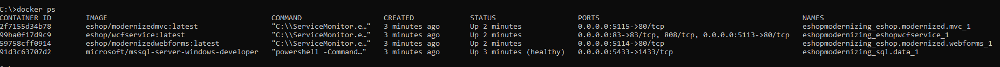
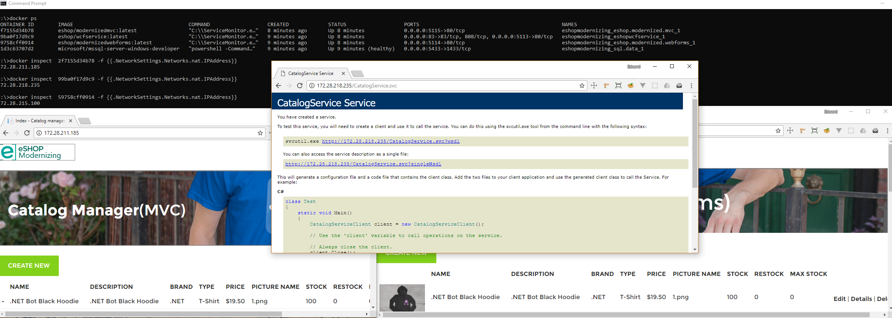

# eShopModernizing - Modernizing ASP.NET Web apps (MVC and WebForms) and N-Tier apps (WCF + WinForms) with Windows Containers and Azure

This repo provides three sample hypothetical legacy eShop web apps (traditional ASP.NET WebForms and MVC in .NET Framework and an N-Tier app based on a WCF service and a client WinForms desktop app) and how you can modernize them (Lift and Shift scenario) with Windows Containers and Azure Cloud into the following deployment options:

- Local build and deployment in dev PC with Visual Studio and Docker for Windows
- Azure Container Instances
- Regular Windows Server 2016 VM (Virtual Machine)
- Azure App Service with Windows Containers support (In Private Preview)
- ACS-Kubernetes orchestrator cluster
- Service Fabric orchestrators cluster
- Service Fabric Mesh (In Private Preview)

All those mentioned environments can be deployed into Azure cloud (as explained in the Wiki) but you can also deploy all those environments into on-premises servers or even in other public clouds.

## Related Guide/eBook
You can download its related guidance with this free guide/eBook (2nd Edition updated in mid-2018):

.PDF download (PC) - 2nd Edition: https://aka.ms/liftandshiftwithcontainersebook

.MOBI download (Kindle) - 1st Edition: https://aka.ms/liftandshiftwithcontainersebookmobi

.EPUB download (Other eReaders) - 1st Edition: https://aka.ms/liftandshiftwithcontainersebookepub

The modernization with Windows Containers significantly improves the deployments for DevOps, without having to change the app's architecture or C# code.

The sample apps are simple web apps for the internal backoffice of an eShop so employees can update the Product Catalog. 
Both apps are therefore simple CRUD web application to update data into a SQL Server database. 

See a screenshots of both apps below.

### INITIAL VERSIONS OF EXISTING ASP.NET WEB APPS

### CONTAINERIZED VERSION IN DEVELOPMENT ENVIRONMENT

### UI and business features

The WebFoms and MVC apps are pretty similiar in regards UI and business features. We just created both versions so you can compare, depending on what technology you are using for your existing apps (ASP.NET MVC or Web Forms).

### Winforms + WCF Application

The winforms application is a catalog management, and uses a WCF as a back-end. Read more about the Winforms + WCF sample [here](./winforms-wcf.md)

### DEPLOYMENT TO AZURE CONTAINER INSTANCES

### DEPLOYMENT TO AZURE WINDOWS SERVER 2016 VM

### DEPLOYMENT TO KUBERNETES CLUSTER IN AZURE CONTAINER SERVICE

### DEPLOYMENT TO SERVICE FABRIC CLUSTER

## Quick start: Running all apps together in your local Windows 10 PC with "Docker for Windows" and VS 2017

You have more detailed procedures at the [Wiki](https://github.com/dotnet-architecture/eShopModernizing/wiki), but for the quickest way to get started and run all samples together using Docker for Windows, open a **"Developer Command Prompt for VS 2017"** (to ensure you have right `msbuild` on `PATH`), go to the eShopModernizing root folder and run the `build.cmd` script. 

This script will:

* Build MVC project
* Build Webforms project
* Build WCF back-end project
* Create three Docker images (Windows Container images):
   * `eshop/modernizedwebforms`
   * `eshop/modernizedmvc`
   * `eshop/wcfservice`

You can check the just created Docker images by running `docker images` from the command line:

Finally just run `docker-compose up` (in the root of the repo) to start all three projects and one SQL Server container. Once containers are started:

* MVC web app listens in: 
     - Port 5115 on the Docker Host (PC) network card IP
     - Port 80 on the internal container's IP
* Webforms web app listens in:  
     - Port 5114 on the Docker Host (PC) network card IP
     - Port 80 on the internal container's IP
* WCF service listens in port: 
     - Port 5113 on the Docker Host (PC) network card IP
     - Port 80 on the internal container's IP

>**Note** You should be able to use `http://localhost:<port>` to access the desired application but **due to a current limitation of Windows Containers this won't probably work (See belo the section "The localhost loopback limitation in Windows Containers Docker hosts")**. 

In order to test the apps/containers from within the Docker host itself (the dev Windows PC) yu need to use the internal IP (container's IP) to access the application. To find the internal IP, just type  `docker ps` to find the container ids:

Then use the command `docker inspect  <CONTAINER-ID> -f {{.NetworkSettings.Networks.nat.IPAddress}}` to find the container's IP, and use that IP **and port 80** to access the container:

### The localhost loopback limitation in Windows Containers Docker hosts

Due to a default NAT limitation in current versions of Windows (see [https://blog.sixeyed.com/published-ports-on-windows-containers-dont-do-loopback/](https://blog.sixeyed.com/published-ports-on-windows-containers-dont-do-loopback/)) you can't access your containers using `localhost` from the host computer.
You have further information here, too: https://blogs.technet.microsoft.com/virtualization/2016/05/25/windows-nat-winnat-capabilities-and-limitations/

Although that [limitation has been removed beginning with Build 17025](https://blogs.technet.microsoft.com/networking/2017/11/06/available-to-windows-10-insiders-today-access-to-published-container-ports-via-localhost127-0-0-1/) (as of early 2018, still only available today to Windows Insiders, not public/stable release). With that version (Windows 10 Build 17025 or later), access to published container ports via “localhost”/127.0.0.1 should be available.

## Review the Wiki for detailed instructions on how to set it up and deploy to multiple environments

Wiki: https://github.com/dotnet-architecture/eShopModernizing/wiki

### Choose in-memory mock-data or real database connection to a SQL Server database

The MVC and WebForms web apps allow either to connect to the real database to get/update the product catalog or to use mock-data if, due to any reason, the database is still not available and you need to test/demo the app. 

For each application, the option to select one or the other mode can be configured in the docker-compose.override.yml file when using Windows Containers or at the `Web.config` file when you still are NOT using Containers (original versions).

